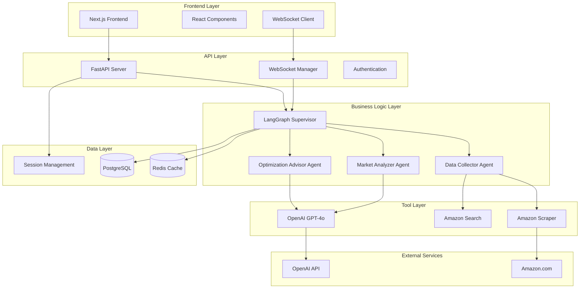

# 🏗️ Architecture Documentation
## 系統設計理念與技術架構說明

### 🎯 設計理念 (Design Philosophy)

Amazon Product Analyzer 採用現代化的微服務架構，結合多智能體系統（Multi-Agent System）與實時通訊技術，旨在建立一個可擴展、高可靠性的產品分析平台。

#### 核心設計原則

1. **模組化設計 (Modular Design)**
   - 每個智能體負責特定功能領域
   - 松耦合架構便於維護與擴展
   - 可獨立部署和測試各個組件

2. **實時性優先 (Real-time First)**
   - WebSocket 即時進度更新
   - 異步處理避免阻塞
   - 用戶體驗優化

3. **容錯性設計 (Fault Tolerance)**
   - 多層錯誤處理機制
   - 自動重試與恢復
   - 優雅降級策略

4. **數據持久化 (Data Persistence)**
   - Redis 快速緩存
   - PostgreSQL 永久存儲
   - 雙重保障數據安全

---

## 🏛️ 整體架構 (Overall Architecture)

### 系統架構圖



### 技術堆疊 (Technology Stack)

| 層級 | 技術選型 | 用途說明 |
|------|----------|----------|
| **前端** | Next.js 14, React 18, TypeScript | 現代化響應式UI，類型安全 |
| **後端** | FastAPI, Python 3.11 | 高性能異步API，自動文檔生成 |
| **智能體框架** | LangGraph, LangChain | 多智能體工作流編排 |
| **AI模型** | OpenAI GPT-4o | 大語言模型分析引擎 |
| **網頁自動化** | Playwright | 可靠的爬蟲與自動化工具 |
| **數據庫** | PostgreSQL 15 | 關係型數據庫，ACID保證 |
| **緩存** | Redis 7 | 高速內存數據庫 |
| **實時通訊** | WebSocket | 雙向實時數據傳輸 |
| **容器化** | Docker, Docker Compose | 標準化部署環境 |

---

## 🤖 多智能體系統設計 (Multi-Agent System Design)

### 智能體架構

#### 1. Supervisor Agent (監督智能體)
```python
class AmazonAnalysisSupervisor:
    """
    主要職責：
    - 工作流程編排與控制
    - 智能體間的數據傳遞
    - 錯誤處理與恢復
    - 進度追蹤與報告
    """
```

**設計特點：**
- 使用 LangGraph 狀態機管理工作流
- 支持條件分支與錯誤恢復
- 實時進度更新與狀態同步

#### 2. Data Collector Agent (數據收集智能體)
```python
class DataCollectorAgent:
    """
    主要職責：
    - Amazon 產品信息爬取
    - 競爭對手自動發現
    - 數據清洗與標準化
    """
    tools = [
        amazon_scraper,
        amazon_scraper_sequential,  # 防阻擋版本
        amazon_search_sequential
    ]
```

**核心功能：**
- **順序爬取**：防止 Amazon 反爬蟲機制
- **智能延遲**：2-4秒隨機間隔
- **多重策略**：用戶代理輪換、請求頭偽造

#### 3. Market Analyzer Agent (市場分析智能體)
```python
class MarketAnalyzerAgent:
    """
    主要職責：
    - 產品市場定位分析
    - 競爭對手深度分析
    - 市場機會識別
    """
    tools = [
        product_analysis,
        competitor_analysis,
        market_positioning
    ]
```

#### 4. Optimization Advisor Agent (優化建議智能體)
```python
class OptimizationAdvisorAgent:
    """
    主要職責：
    - 產品優化策略生成
    - 市場定位建議
    - 可執行建議輸出
    """
    tools = [
        market_positioning,
        product_optimizer
    ]
```

### 智能體通訊機制

#### Session Context (會話上下文)
```python
class SessionContext:
    """
    跨智能體共享的會話狀態管理
    """
    def __init__(self):
        self.session_id = None
        self.product_data = None
        self.analysis_results = {}
        self.progress_tracker = {}
```

#### Message Passing (消息傳遞)
- **狀態共享**：通過 LangGraph 狀態機傳遞數據
- **實時通知**：WebSocket 即時更新前端
- **數據持久化**：Redis + PostgreSQL 雙重保存

---

## 🔄 實時通訊架構 (Real-time Communication)

### WebSocket 管理器設計

```python
class WebSocketManager:
    """
    高可靠性 WebSocket 連接管理
    """
    def __init__(self):
        self.active_connections = {}     # 活躍連接
        self.message_buffer = {}         # 消息緩衝
        self.send_locks = {}            # 發送鎖（防止JSON串聯）
        self.connection_metadata = {}    # 連接元數據
```

#### 核心特性

1. **連接池管理**
   - 自動連接清理
   - 連接狀態監控
   - 重連機制

2. **消息序列化**
   - JSON 格式驗證
   - 消息鎖機制防止串聯
   - 緩衝區管理

3. **錯誤處理**
   - 連接斷開自動檢測
   - 消息發送失敗重試
   - 優雅降級處理

### 消息流設計

```
智能體 --> 消息產生 --> 序列化鎖 --> JSON驗證 --> WebSocket發送 --> 前端接收
   ↓
數據庫保存 --> Redis緩存 --> 狀態同步
```

---

## 💾 數據架構設計 (Data Architecture)

### 三層數據模型

#### 1. 緩存層 (Cache Layer) - Redis
```python
class RedisManager:
    """
    高速數據訪問與會話管理
    """
    PREFIXES = {
        "session": "session:",
        "result": "result:",
        "progress": "progress:",
        "websocket": "ws:"
    }
```

**用途：**
- 會話狀態快速訪問
- WebSocket 連接管理
- 臨時數據緩存
- 分布式鎖實現

#### 2. 持久化層 (Persistence Layer) - PostgreSQL
```sql
-- 分析會話表
CREATE TABLE analysis_sessions (
    id SERIAL PRIMARY KEY,
    session_id VARCHAR(255) UNIQUE,
    amazon_url TEXT,
    status VARCHAR(50),
    created_at TIMESTAMP,
    completed_at TIMESTAMP
);

-- 產品數據表
CREATE TABLE products (
    id SERIAL PRIMARY KEY,
    session_id VARCHAR(255),
    asin VARCHAR(20),
    title TEXT,
    price DECIMAL(10,2),
    brand VARCHAR(255),
    is_main BOOLEAN
);
```

#### 3. 分析結果層 (Analytics Layer)
```python
class AnalysisResult:
    """
    結構化分析結果存儲
    """
    session_id: str
    product_analysis: str
    competitor_analysis: str
    market_positioning: str
    optimization_strategy: str
```

### 數據一致性保證

1. **ACID 事務**：PostgreSQL 保證數據一致性
2. **最終一致性**：Redis 與 PostgreSQL 異步同步
3. **冪等性設計**：重複操作不影響結果
4. **數據校驗**：多層驗證確保數據質量

---

## 🔒 安全性設計 (Security Design)

### 1. 數據安全
- **無個人數據存儲**：僅保存公開產品信息
- **自動清理機制**：定期清理過期會話
- **數據加密**：敏感配置加密存儲

### 2. 網絡安全
- **CORS 配置**：跨域請求控制
- **Rate Limiting**：請求頻率限制
- **用戶代理輪換**：防止IP封鎖

### 3. 爬蟲安全
- **Robots.txt 遵循**：尊重網站爬蟲策略
- **禮貌延遲**：避免服務器過載
- **錯誤處理**：優雅處理反爬蟲措施

---

## ⚡ 性能優化策略 (Performance Optimization)

### 1. 前端優化
```typescript
// React 組件優化
const AnalysisProgress = React.memo(({ session, progress }) => {
    // 使用 useMemo 避免重複計算
    const progressData = useMemo(() => 
        calculateProgress(progress), [progress]
    );
    
    return <ProgressDisplay data={progressData} />;
});
```

### 2. 後端優化
```python
# 異步處理與連接池
class DatabaseManager:
    def __init__(self):
        self.engine = create_async_engine(
            DATABASE_URL,
            pool_size=20,          # 連接池大小
            max_overflow=30,       # 最大溢出連接
            pool_recycle=1800      # 連接回收時間
        )
```

### 3. 爬蟲優化
- **順序處理**：避免並發請求被封鎖
- **智能延遲**：動態調整請求間隔
- **緩存重用**：避免重複爬取相同數據

### 4. 數據庫優化
```sql
-- 索引優化
CREATE INDEX idx_sessions_status ON analysis_sessions(status);
CREATE INDEX idx_products_session ON products(session_id);
CREATE INDEX idx_progress_session ON agent_progress(session_id);
```

---

## 🔧 可擴展性設計 (Scalability Design)

### 1. 水平擴展能力
- **無狀態服務**：API 服務器可水平擴展
- **數據庫分片**：支持數據水平分割
- **負載均衡**：支持多實例部署

### 2. 垂直擴展能力
- **資源配置**：CPU/內存可動態調整
- **連接池調優**：數據庫連接數可配置
- **緩存大小**：Redis 內存使用可控制

### 3. 微服務架構
```yaml
# Docker Compose 服務分離
services:
  frontend:     # 前端服務
  backend:      # API 服務
  worker:       # 後台任務處理
  redis:        # 緩存服務
  postgres:     # 數據庫服務
```

---

## 🚨 錯誤處理與監控 (Error Handling & Monitoring)

### 1. 多層錯誤處理
```python
class ErrorHandler:
    """
    統一錯誤處理機制
    """
    def handle_scraping_error(self, error):
        # 爬蟲錯誤：重試機制
        pass
    
    def handle_llm_error(self, error):
        # LLM 錯誤：降級處理
        pass
    
    def handle_network_error(self, error):
        # 網絡錯誤：指數退避重試
        pass
```

### 2. 實時監控
- **健康檢查**：`/health` 端點監控
- **性能指標**：響應時間、成功率統計
- **錯誤追蹤**：詳細錯誤日誌記錄

### 3. 自動恢復
- **斷線重連**：WebSocket 自動重連
- **數據恢復**：從緩存/數據庫恢復狀態
- **降級服務**：關鍵功能保持可用

---

## 🏗️ 部署架構 (Deployment Architecture)

### 1. 容器化部署
```dockerfile
# 多階段構建優化
FROM node:18-alpine AS frontend-builder
FROM python:3.11-slim AS backend-builder
FROM nginx:alpine AS production
```

### 2. 環境配置
```yaml
# 環境變量管理
environment:
  - NODE_ENV=production
  - DATABASE_URL=${DATABASE_URL}
  - REDIS_URL=${REDIS_URL}
  - OPENAI_API_KEY=${OPENAI_API_KEY}
```

### 3. 服務編排
```yaml
# Docker Compose 生產配置
version: '3.8'
services:
  app:
    depends_on:
      - redis
      - postgres
    restart: unless-stopped
    healthcheck:
      test: ["CMD", "curl", "-f", "http://localhost:8000/health"]
```

---

## 🔮 未來擴展計劃 (Future Extensions)

### 1. 智能體擴展
- **價格監控智能體**：追蹤價格變化趨勢
- **評論分析智能體**：深度情感分析
- **銷量預測智能體**：AI 銷量預測

### 2. 功能增強
- **多平台支持**：擴展到其他電商平台
- **API 集成**：官方 API 替代爬蟲
- **機器學習**：個性化推薦算法

### 3. 技術升級
- **GraphQL API**：更靈活的數據查詢
- **消息隊列**：異步任務處理優化
- **微服務拆分**：服務粒度進一步細化

---

## 📚 技術文檔參考 (Technical References)

### 相關技術文檔
- [LangGraph 官方文檔](https://langchain-ai.github.io/langgraph/)
- [FastAPI 文檔](https://fastapi.tiangolo.com/)
- [Playwright 文檔](https://playwright.dev/)
- [Redis 文檔](https://redis.io/documentation)
- [PostgreSQL 文檔](https://www.postgresql.org/docs/)

### 架構設計參考
- Clean Architecture
- Domain-Driven Design (DDD)
- Event-Driven Architecture
- CQRS Pattern

---

*本文檔隨系統演進持續更新*
*最後更新：2024年12月*